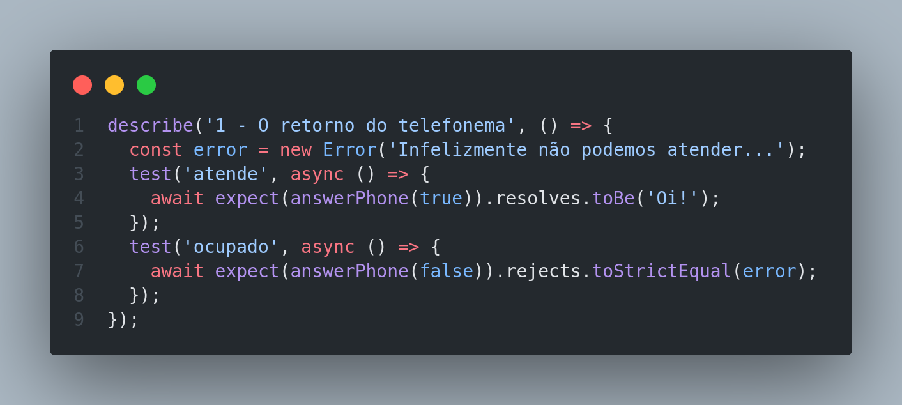
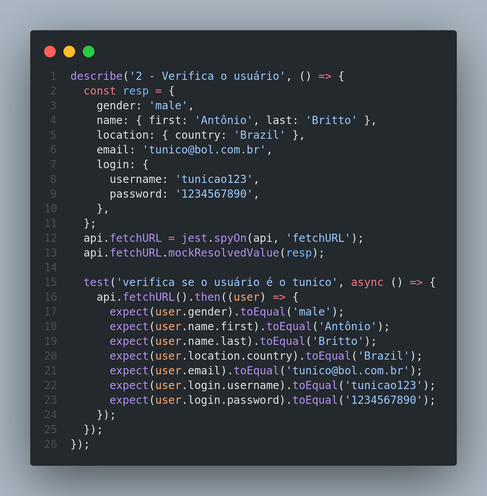
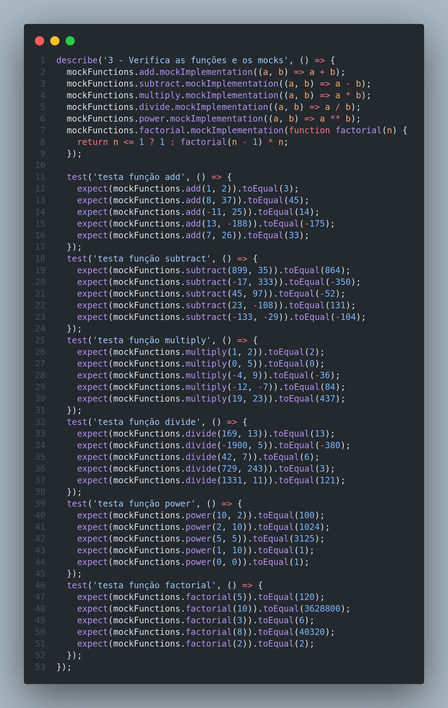
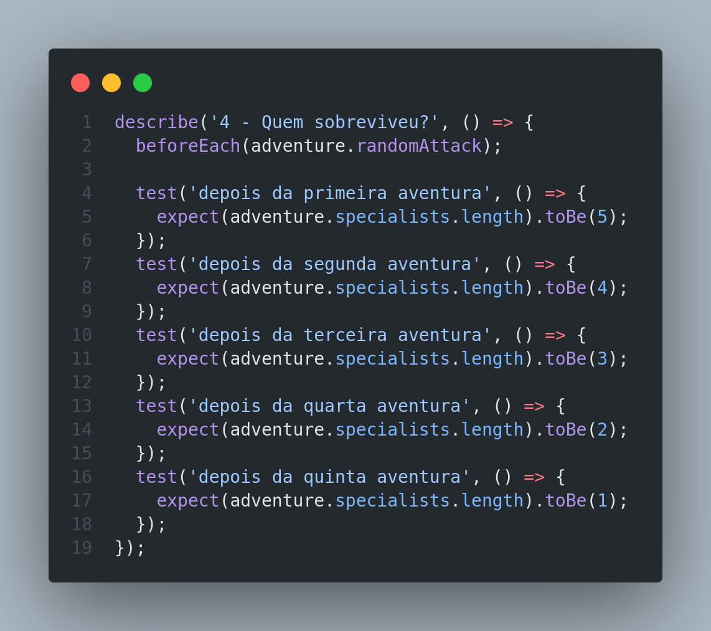

# Trybe Project Jest 20/08/2021
 

  
  

 

## Habilidades

- Escrever testes para funções assíncronas;
- Aplicar os seus conhecimentos acerca de testes utilizando o Jest;
- Mockar funções;
- Mockar APIs.

## Desenvolvimento
Testes utilizando o Jest para verificar se uma série de funções estão funcionando corretamente.

 

  
  
  
  

## Resultados

- `1` dia de projeto;
- `4` requisitos;
- Percentual de cumprimento de requisitos obrigatórios `100.00%`;
- Percentual de cumprimento de requisitos totais `100.00`.
